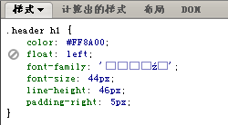
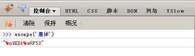

在 CSS 中使用中文字体通常直接设置字体名称，比如设置字体为宋体：font-family:’宋体’；但因此产生的一个问题是，如果 CSS 编码有误，会导致页面加载后 CSS 中的中文字体乱码，请看下图所示：

通常会采用对中文字体进行 Unicode 编码的方式来解决这个危险的问题。比如字符“宋体”经过 Unicode 编码后为 “\5b8b\4f53″。以淘宝为例：font:12px/1.5 tahoma,arial,\5b8b\4f53; 预选的中文字体是编码后的宋体。

于此获得到了 “%u9ED1%u4F53″，将其改写为 “\9ED1\4F53″ 即可写入 CSS 文件。

<table>
    <thead>
        <tr>
            <th>中文名</th>
            <th>Unicode</th>
        </tr>
    </thead>
    <tbody>
        <tr>
            <td>新细明体</td>
            <td>\65B0\7EC6\660E\4F53</td>
        </tr>
        <tr>
            <td>细明体</td>
            <td>\7EC6\660E\4F53</td>
        </tr>
        <tr>
            <td>标楷体</td>
            <td>\6807\6977\4F53</td>
        </tr>
        <tr>
            <td>黑体</td>
            <td>\9ED1\4F53</td>
        </tr>
        <tr>
            <td>宋体</td>
            <td>\5B8B\4F53</td>
        </tr>
        <tr>
            <td>新宋体</td>
            <td>\65B0\5B8B\4F53</td>
        </tr>
        <tr>
            <td>仿宋</td>
            <td>\4EFF\5B8B</td>
        </tr>
        <tr>
            <td>楷体</td>
            <td>\6977\4F53</td>
        </tr>
        <tr>
            <td>仿宋_GB2312</td>
            <td>\4EFF\5B8B_GB2312</td>
        </tr>
        <tr>
            <td>楷体_GB2312</td>
            <td>\6977\4F53_GB2312</td>
        </tr>
        <tr>
            <td>微软正黑体</td>
            <td>\5FAE\x8F6F\6B63\9ED1\4F53</td>
        </tr>
        <tr>
            <td>微软雅黑</td>
            <td>\5FAE\8F6F\96C5\9ED1</td>
        </tr>
    </tbody>
</table>

这样或许还是有些小麻烦，那也没关系，芒果这里有一份比较完整的表格，自己查吧。

转载自 http://www.mangguo.org/css-chinese-font-unicode-encode-solution ------ 芒果

