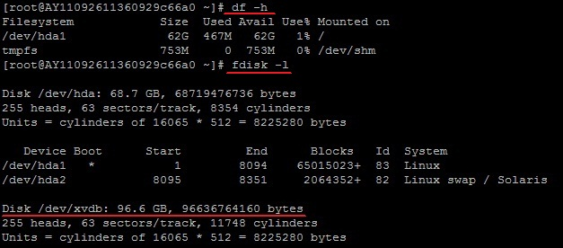
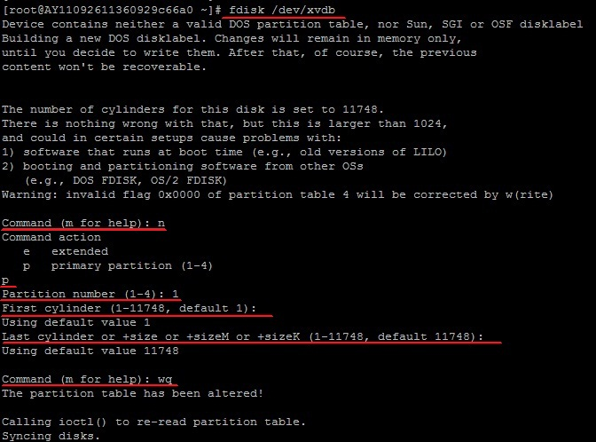
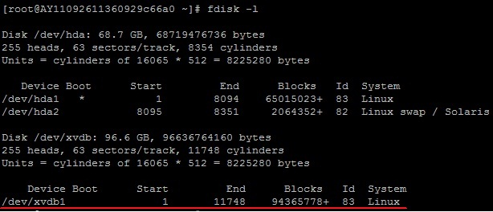
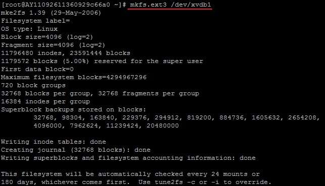

适用系统：Linux（Redhat , CentOS，Debian，Ubuntu）
*  Linux的云服务器数据盘未做分区和格式化，可以根据以下步骤进行分区以及格式化操作。
下面的操作将会把数据盘划分为一个分区来使用。

####1、查看数据盘
在没有分区和格式化数据盘之前，使用 “df –h”命令，是无法看到数据盘的，可以使用“fdisk -l”命令查看。如下图：

_友情提示：若您执行fdisk -l命令，发现没有 /dev/xvdb 表明您的云服务无数据盘，那么您无需进行挂载，此时该教程对您不适用_

####2、对数据盘进行分区
执行“fdisk -S 56 /dev/xvdb”命令，对数据盘进行分区；

根据提示，依次输入“n”，“p”“1”，两次回车，“wq”，分区就开始了，很快就会完成。

####3、查看新的分区
使用“fdisk -l”命令可以看到，新的分区xvdb1已经建立完成了。

.jpg)

####4、格式化新分区
以ext3为例：使用“mkfs.ext3 /dev/xvdb1”命令对新分区进行格式化，格式化的时间根据硬盘大小有所不同。
(也可自主决定选用其它文件格式，如ext4等)

####5、添加分区信息
使用“echo '/dev/xvdb1  /mnt ext3    defaults    0  0' >> /etc/fstab”（不含引号）命令写入新分区信息。
然后使用“cat /etc/fstab”命令查看，出现以下信息就表示写入成功。

_注：ubuntu12.04不支持barrier，所以正确写法是：echo '/dev/xvdb1  /mnt ext3    barrier=0  0  0' >> /etc/fstab_

__*  如果需要把数据盘单独挂载到某个文件夹，比如单独用来存放网页，可以修改以上命令中的/mnt部分__

####6、挂载新分区
使用“mount -a”命令挂载新分区，然后用“df -h”命令查看，出现以下信息就说明挂载成功，可以开始使用新的分区了。

